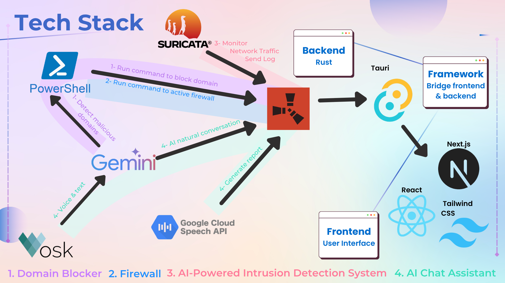

# Security Smile 🔐

**Security Smile** is a comprehensive network security monitoring and management application that provides real-time threat detection, firewall management, and network traffic analysis. 

## 🎬 Links

- **📺 Demo Video**: [Video Link](https://your-video-link.com)
- **🎨 Presentation Slides**: [Canva Link](https://www.canva.com/design/DAGoz6FV8WQ/xNwbbauNySu1tWMrUZ0zUQ/view?utm_content=DAGoz6FV8WQ&utm_campaign=designshare&utm_medium=link2&utm_source=uniquelinks&utlId=hf29dd10416)

## 🏗️ System Architecture



### 🛠️ Technology Stack

- **Frontend**: Next.js 15+ with TypeScript, TailwindCSS, React Charts
- **Backend**: Rust with Tauri 2.0 framework
- **Security Engine**: Suricata IDS with custom rule management
- **UI Components**: Lucide React icons, responsive design
- **Network**: Windows Firewall integration, Npcap for packet capture

## ✨ Features

### 🛡️ **Core Security Components**
- **Real-time Network Intrusion Detection** - Powered by Suricata IDS for advanced threat detection
- **Intelligent Firewall Management** - Create, manage, and monitor firewall rules with ease
- **Domain Blocking System** - Block malicious domains company-wide with automatic IP resolution
- **Network Traffic Analysis** - Monitor and analyze network patterns with detailed reporting
- **AI Security Assistant** - Get intelligent explanations of alerts and security recommendations

### 🎯 **Key Capabilities**
- **Live Threat Monitoring** - Real-time alerts for security incidents and intrusions
- **Department-based Access Control** - Manage network policies by organizational departments
- **Automated Domain Resolution** - Smart DNS resolution and IP tracking for blocked domains
- **Interactive Security Dashboard** - Visual analytics with charts and incident tracking
- **System Tray Integration** - Monitor security status from the system tray
- **Notification System** - Configurable alerts for security events

### 🔍 **Network Analysis**
- **Suricata Integration** - Professional-grade intrusion detection system
- **Flow Analysis** - Track network connections and data flows
- **Alert Classification** - Categorize threats by severity and type
- **Historical Reporting** - Generate comprehensive security reports
- **Machine Learning Ready** - Collect data for advanced threat analysis

## 🎯 Usage Guide

### Security Dashboard
- **Main Dashboard**: Real-time security status overview with visual indicators
- **Threat Analytics**: View incident trends and threat severity distribution
- **System Status**: Monitor overall security posture and system health

### Firewall Management
Navigate to `/firewall` to access:
- **Device Management**: Create and manage firewall rules
- **Department Setup**: Configure department-based access policies  
- **Inter-Department Rules**: Manage cross-department network permissions

### Domain Blocking
Access via `/domain-blocker`:
- **Block Domains**: Add malicious domains to the blocklist
- **IP Resolution**: Automatic resolution of domains to IP addresses
- **Real-time Monitoring**: Background monitoring for blocked domain access attempts

### Network Analysis
Go to `/network-traffic-analysis` for:
- **Live Traffic Monitoring**: Real-time network flow analysis
- **Alert Review**: Examine Suricata-generated security alerts
- **Traffic Reports**: Generate detailed network usage reports

### AI Security Assistant
- **Intelligent Analysis**: Get AI-powered explanations of security alerts
- **Threat Context**: Understand the severity and implications of detected threats
- **Actionable Recommendations**: Receive specific steps to mitigate security issues

## 🚀 Quick Start

### Prerequisites
- Node.js 18+ and pnpm
- Rust and Cargo
- Windows OS (for firewall management)
- Administrator privileges (for network operations)

### Installation

1. **Clone the repository**
   ```bash
   git clone https://github.com/HoeZhiWan/hackattack2025
   cd hackattack
   ```

2. **Install dependencies**
   ```bash
   pnpm install
   ```

3. **Install Suricata and Npcap** (see detailed instructions below)

4. **Run in development mode**
   ```bash
   pnpm tauri dev
   ```

5. **Build for production**
   ```bash
   pnpm tauri build
   ```

## 📋 System Requirements

### Required Software Installation

#### Suricata IDS Setup
Suricata is required for network intrusion detection and traffic analysis.

## Installing Suricata on Windows

1. **Download the Suricata Windows Installer**
    - Go to the official Suricata downloads page:
    https://suricata.io/download/
    - Under Windows, download the latest .msi installer (e.g., Suricata-7.x.x-1-64bit.msi).
2. **Run the Installer**
    - Double-click the downloaded .msi file.
    - Follow the installation prompts.
    - By default, Suricata will be installed to C:\Program Files\Suricata.
3. **Add Suricata to Your PATH**
    - Open the Start Menu, search for Environment Variables, and open Edit the system environment variables.
    - Click Environment Variables.
    - Under System variables, find and select Path, then click Edit.
    - Click New and add:
        C:\Program Files\Suricata
    - Click OK to save.
4. **Download the Emerging Threats Open Rules ZIP File**
    - Go to the [Emerging Threats Open Ruleset](https://rules.emergingthreats.net/open/suricata/) page.
    - Download the latest rules ZIP for your Suricata version, for example:  
      [https://rules.emergingthreats.net/open/suricata-7.0/emerging.rules.zip](https://rules.emergingthreats.net/open/suricata-7.0/emerging.rules.zip)
    - Right-click the downloaded `emerging.rules.zip` file and select "Extract All..."
    - Extract the contents to a folder (e.g., your Downloads folder).
    - Open the extracted folder. You will see many `.rules` files.
    - Copy all `.rules` files to your Suricata rules directory:  
      `C:\Program Files\Suricata\rules`
5. **Download and Install Npcap**
    - Go to the official Npcap website:  
      [https://nmap.org/npcap/](https://nmap.org/npcap/)
    - Click the **Download** link to get the latest Npcap installer (e.g., `npcap-<version>.exe`).
    - Run the installer and follow the prompts.
    - During installation, make sure that "Install Npcap in WinPcap API-compatible Mode" is checked.
    - Click **Install** and wait for the process to complete.
    - After installation, Npcap will be ready for Suricata to use for live network capture.
    - Ensure that the wpcap.lib and Packet.lib files exist in the `C:\Program Files\Npcap\Lib` directory.
    - if wpcap.lib and Packet.lib does not exists, install Npcap SDK 1.15 (zip) from the offical Npcap website.
    - Extract the contents into a folder, then copy all of the contents to the npcap directory `C:\Program Files\Npcap\Lib`.

## 📝 Development

### Building and Testing
```bash
# Development
pnpm tauri dev

# Production build
pnpm tauri build

# Run tests
cargo test

# Frontend development
pnpm dev
```

---

**Security Smile** - Protecting your network with intelligence and ease. 🔐😊

*Developed for Heart Attack 2025 by Team Leng Lui Leng Zai*